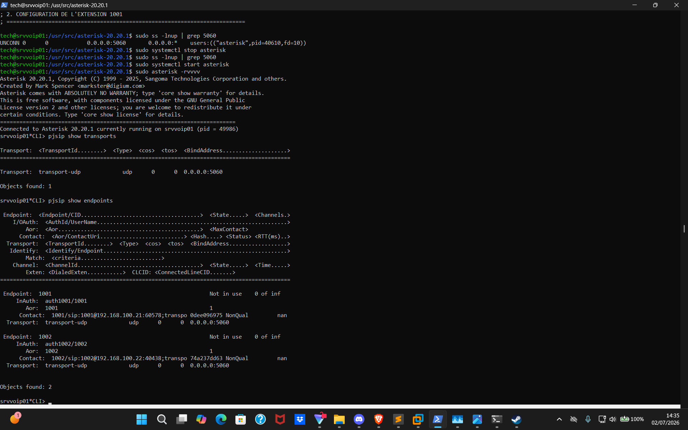

# Rapport de TP : Migration d'un IP-PBX Asterisk v20 vers PJSIP - Syltux

## 6. QUESTIONS DE VALIDATION

### Question 1 : Expliquez avec vos propres mots pourquoi l'architecture en 4 blocs d'objets distincts de PJSIP (Transport, Endpoint, Auth, Aor), bien que plus longue à écrire, offre une plus grande flexibilité à un administrateur réseau qu'un bloc unique dans l'ancien sip.conf.

**Votre réponse :**

Configuration logique en blocs de responsabiltiés métiers: transport, endpoint, authorisation et aor. De la sorte un endpoint peut être associé à plusieurs devices. Cela permet d'avoir une séparation des responsabilités et un fichier plus facilement lisible et maintenable avec moins de risques d'erreurs en faisant usage de variables globales. 
Et ce sont ces variables dynamiques qu'on passe à nos configurations utilisateurs ce qui est beaucoup plus modulaire et plus flexible que des valeurs en dur dans sip.conf (ex: transport=transport-udp, allow=ulaw, alaw, auth=auth1001, aors=1001). 
C'est aussi plus sûr en terme de securité. Par la suite on touchera une valeur sur une ligne tout en répercutant automatiquement cette valeur dans les instances qui l'appelent, en diminuant les risques de tout casser et avec une bien meilleure lisibilité du code.

Dans notre TP le transport sera probablement peu amené à bouger et est réutilisé pour 1001 et 1002.

Pour conclure, ce sont des valeurs en dynamique donc cela renforce l'aspect d'infrastructure robuste: on change une valeur qui se répercute au lieu d'avoir un nombre exponentiel x d'entrées à créer selon x devices comme c'était le cas dans sip.conf (un compte = toutes les lignes à saisir à chaque fois). Gain en productivité également.

---

### Question 2 : Dans le fichier pjsip.conf, quelle est l'utilité concrète de l'objet type=aor et que se passerait-il techniquement si vous modifiiez le paramètre max_contacts=1 par la valeur 3 ?

**Votre réponse :**
Aor va enregistrer l'IP du softphone qui va envoyer le REGISTER (Zoiper dans notre cas). 
max_contacts est le nombre de devices simultanés maximum qui peuvent s'enregistrer pour cet aor. Si on en a 3 , les trois devices enregistrés vont sonner simultanément en cas d'appel, le premier qui décroche poursuit la transaction REGISTER/INVITE/RING/ACK/BYE (à partir de ACK du coup).

---

### Question 3 : Quelle commande tapez-vous dans la CLI Asterisk pour lister vos utilisateurs PJSIP connectés ? Copiez précisément le tableau de résultat affiché par votre console montrant vos deux extensions à l'état connecté.

**Votre réponse :**
Commande CLI : `pjsip show endpoints`

**Tableau de résultat de la console Asterisk remise en forme :**

| Type d'Objet | Nom / Identifiant | Statut / URI | Contacts Max / Canaux | Protocole / Bind Address |
| :--- | :--- | :--- | :--- | :--- |
| **Endpoint** | **1001** | *Not in use* | 0 of inf | |
| *InAuth* | auth1001/1001 | | | |
| *Aor* | 1001 | | 1 | |
| *Contact* | 1001 | sip:1001@192.168.100.21:60578 | NonQual | |
| *Transport* | transport-udp | | | udp / 0.0.0.0:5060 |
| | | | | |
| **Endpoint** | **1002** | *Not in use* | 0 of inf | |
| *InAuth* | auth1002/1002 | | | |
| *Aor* | 1002 | | 1 | |
| *Contact* | 1002 | sip:1002@192.168.100.22:40438 | NonQual | |
| *Transport* | transport-udp | | | udp / 0.0.0.0:5060 |

**Objects found :** 2

